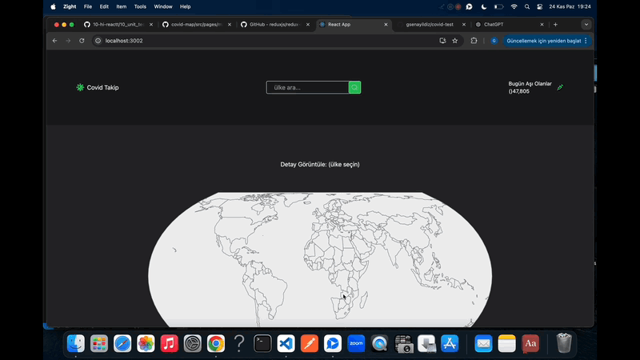

## covid-map
COVID-Map Projesi, haritalar üzerinde COVID-19 verilerini görselleştirmek için geliştirilen bir uygulamadır. Projede kullanılan kütüphaneler, haritalama, stil oluşturma, durum yönetimi, test işlemleri ve API veri çekme işlemleri için zengin bir araç seti sunar. Bu sayede proje, modern bir arayüz ve kullanıcı dostu özellikler ile donatılmıştır.

# Kütüphaneler

- react-router-dom
- react-icons
- tailwind
- react-simple-maps
- @reduxjs/toolkit
- redux-mock-store'
- react-redux
- @testing-library/user-event@14.0
- axios@^0.27.2
- react-testing-library
- jest
- thunk

- 